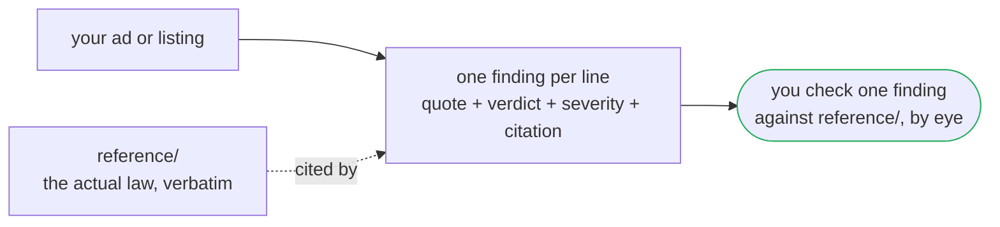

# The Auditor

Point it at a real-estate listing or ad. It tells you which lines pass the Fair Housing Act's advertising rules and which fail, with the exact provision each finding cites and the exact phrase that triggered it.

**Before.** A property manager reads the ad, gets a gut feeling something's off, maybe googles "fair housing words to avoid," and hopes they caught everything.
**After.** Every line gets a verdict: PASS, FAIL, or Out of scope. Every FAIL names the law it fails and quotes it. You open the finding, open `reference/`, and check the two match yourself.

## Use it

1. Drop `identity.md`, `rules.md`, `examples.md`, `reference/`, and this README into a Claude project (or point Claude Code at this folder).
2. Give it a listing description, print ad, flyer, or MLS remarks field. Advertising copy only — not a lease, not a screening policy.
3. Read `identity.md` and `rules.md` first so you know the report shape it's going to produce. Then hand over the artifact.
4. You get back one finding per line: a located quote, PASS or FAIL, a severity (Pass / Violation / High-risk / Cautionary / Out of scope), and the exact provision text it's citing.

See `examples.md` for three worked audits before you run your first real one. `sample-listing.md` is the synthetic listing this build's own tests run against — audit it yourself and compare your findings to `verify/audits/sample-listing.findings.json` if you want to sanity-check the auditor before trusting it on something real.

## The one rule

**Every finding cites a provision, and the citation is checkable.** `reference/` holds the actual text of 42 U.S.C. § 3604(c) and 24 CFR § 100.75, quoted word for word from the U.S. Code and the Code of Federal Regulations, not a summary and not a link. Open any FAIL finding, open the provision it names in `reference/`, and read them side by side. If the finding's quoted law doesn't match what's actually in `reference/`, the finding is wrong, full stop — and `verify/check.mjs` exists specifically to catch that before you ever see it.

`reference/phrase-guidance.md` is different: it's sourced guidance (HUD's informal guidance, the National Fair Housing Alliance, real-estate trade associations), not binding law, and every finding that leans on it also has to name the binding provision underneath. See `rules.md` for exactly how that works, including the one place the law itself has a trap: HUD's old advertising word-list regulation was pulled from the books in 1996. It gets treated as guidance here, never cited as current law.

## What it won't do

It doesn't give legal advice, doesn't predict how a court would rule, and doesn't rewrite your ad for you. It checks the seven classes the federal Fair Housing Act actually names — race, color, religion, sex, disability, familial status, national origin — and it says plainly when something looks like a problem outside that list (source of income, for instance), because that might still be illegal under your state or city's rules, just not under the two provisions this folder enforces.

## How this build proves itself

- `verify/check.mjs` re-derives every citation from `reference/` and fails loud if a finding's quote doesn't match byte for byte, cites a provision that doesn't exist, or is missing a severity. Run it: `node verify/check.mjs`.
- Every check has a negative fixture in `verify/fixtures/` that's supposed to fail — a citation to a provision that doesn't exist, a misquoted provision, a violation with no citation, a false PASS on an obviously bad line, a finding with no severity. If a fixture ever passes, the gate it tests is dead, and CI treats that as a failure in itself.
- `receipts/` (outside this folder, so it can't leak answers into a walk) holds the frozen test method, a cold walk by a fresh AI session given only this folder, a control run of the same listing with no folder at all, and a human walk where a real person checks one finding against `reference/` by hand. Read `receipts/TEST_METHOD.md` for what was tested and the bar each test had to clear.

## What's synthetic here

`sample-listing.md` is a listing I wrote for this repo. No real property, agent, or brokerage. It exists to give the auditor (and its own tests) a realistic artifact with a real spread of clean lines, violations, and one contested phrase to check against.
